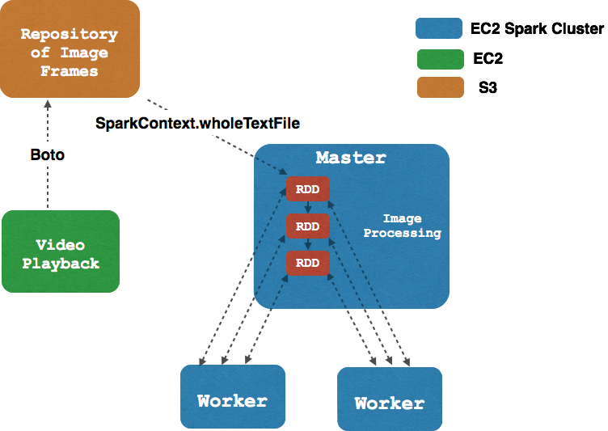

# Spark Hackathon

## Code and Workbook

Original repo is [here](https://github.com/jyt109/amber_alert) and the workbench notepad is [here](https://share.knowledgeanyhow.org/#/api/v1/workbench/10.115.23.246/shares/zvDxoyheLpe9RmE/PYSPARK.ipynb).

##Motivation

Every day tens and hundreds of children are reported missing. As an initiative to find these missing children, 
[AMBER Alert](http://www.amberalert.gov/) was created to broadcast reports of these missing children. Some 
of these reports include descriptions of vehicles the children was last seen on before they have gone missing.

##Goal

The goal of this project is to leverage Spark to analysis video feeds of car traffic in order to identify vehicles
that are described in AMBER Alert reports. The following flow chart show the components and architecture of the
product

##Streaming 
The actual application will be using a live video feed from a traffic cam. The images of the live feed will be 
streamed to a Spark cluster using **Spark Streaming**. The images will be subsequently processed and analyzed
(see below).

##Image Processing
The images streamed would go through an object detection algorithm to pull out images of cars out of the live 
feed. This will leverage the edge detection algorithms and key feature detection algorithms (SIFT) in the
computer vision library [OpenCV](http://opencv.org/). Since there are many image being streaming in, we will
using **Spark** to distribute the OpenCV related jobs.

##Machine Learning
We will train a machine learning model (Neural Net, Random Forest etc) using previously labeled images. This will
leverage **H20**, **the machine learning software built on top of Spark's MLlib**. The machine learning model will
take in and train on images labeled by model and color (i.e. Red Toyota Prius). The trained model will be able to
accept images and predict the model and color of the car.

##Application Front End
The front end will allow the user to input a list of vehicles of interest and would list images that would
match those descriptions.